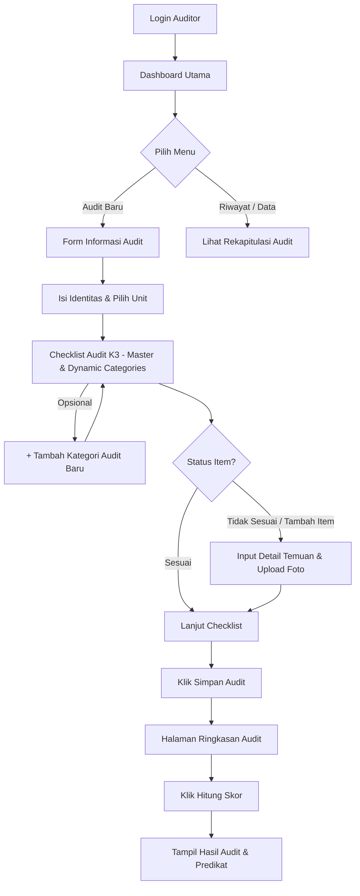
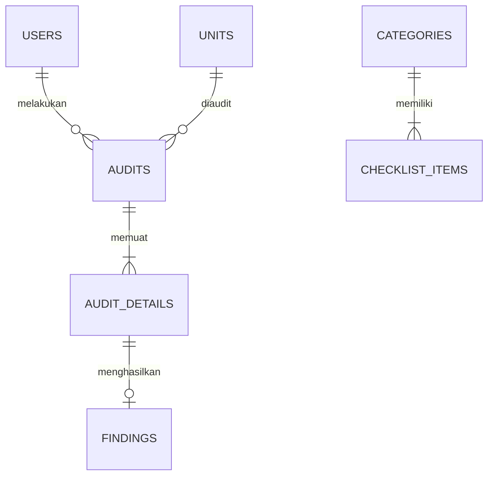

# PRD & PERANCANGAN SISTEM INFORMASI AUDIT K3 RUMAH SAKIT (SIAK3-RS)

Dokumen ini berisi Spesifikasi Kebutuhan Produk (*Product Requirement Document* - PRD), Rancangan Arsitektur Sistem, Skema Database SQL Supabase, serta **Panduan Setup Deployment Gratis ke Netlify & Supabase** untuk **Sistem Informasi Audit Keselamatan dan Kesehatan Kerja Rumah Sakit (SIAK3-RS)**.

---

## 1. RINGKASAN PRODUK (PRODUCT OVERVIEW)

**SIAK3-RS** adalah aplikasi berbasis web yang dirancang untuk mempermudah auditor K3RS dalam melakukan inspeksi, pencatatan evaluasi standar K3, identifikasi temuan risiko, hingga perhitungan nilai kelayakan audit secara otomatis di berbagai unit kerja rumah sakit.

### Tujuan Utama
1. **Digitalisasi Checklist K3RS**: Menggantikan formulir kertas menjadi sistem digital yang terstruktur dan dinamis.
2. **Standardisasi Penilaian**: Otomatisasi kalkulasi skor dan kualifikasi predikat K3RS sesuai formula standar mutu.
3. **Manajemen Temuan & Risiko**: Pelaporan temuan ketidaksesuaian lengkap dengan tingkat risiko, rekomendasi perbaikan, dan foto bukti visual.
4. **Dashboard Eksekutif**: Menyajikan ringkasan pelaksanaan audit dan riwayat unit secara *real-time*.

---

## 2. PENGGUNA SISTEM (USER ROLES)

| Role | Deskripsi & Hak Akses |
| :--- | :--- |
| **Auditor K3** | Mengisi formulir audit baru, mengelola/menambah kategori audit & item checklist kustom secara dinamis, mencatat temuan & upload foto, serta meninjau ringkasan & kalkulasi skor. |
| **Manajemen / Kepala K3RS** | Melihat dashboard analitik eksekutif, memantau tren temuan risiko, dan mengunduh/mencetak laporan hasil audit unit. |

---

## 3. ALUR SISTEM (SYSTEM WORKFLOW)



---

## 4. SPESIFIKASI MODUL & FITUR (FUNCTIONAL REQUIREMENTS)

### 4.1. Modul Dashboard Utama
- **Header Greeting**: Menyapa auditor yang sedang aktif (contoh: *"Selamat Datang, Dian!"*).
- **Executive Summary Cards**:
  - Total Jumlah Audit yang telah dilakukan.
  - Total Temuan Ketidaksesuaian (*Non-conformity*).
  - Jumlah Unit yang telah diaudit.
- **Tabel Riwayat Audit Terbaru**: Menampilkan transaksi audit terakhir beserta unit, tanggal, nilai skor, dan predikat.

### 4.2. Modul Audit Baru (Informasi Audit)
Formulir bagian atas untuk menetapkan konteks audit:
- **Nomor Audit**: Auto-generated oleh sistem dengan format standar (contoh: `AUD-K3-202606-001`).
- **Tanggal Audit**: Picker tanggal (default: hari ini).
- **Nama Auditor**: Auto-filled dari sesi login akun yang aktif (dapat disesuaikan jika tim).
- **Unit yang Diaudit** (Dropdown Selector 10 Unit Utama):
  1. IGD
  2. ICU
  3. Rawat Inap
  4. Rawat Jalan
  5. Kamar Operasi
  6. Laboratorium
  7. Radiologi
  8. Farmasi
  9. CSSD
  10. Laundry
- **Jenis Audit** (Radio / Pill Select): `Internal` | `Berkala` | `Insidental`

### 4.3. Modul Checklist Audit K3RS (Kategori Master & Dinamis)
Secara default, sistem menyediakan 8 Kategori Standar K3RS (A s.d H):
1. **A. Administrasi K3** (4 Item bawaan)
2. **B. Alat Pelindung Diri (APD)** (4 Item bawaan)
3. **C. Pencegahan Kebakaran** (5 Item bawaan)
4. **D. Keselamatan Listrik** (4 Item bawaan)
5. **E. Pengelolaan Limbah Medis** (4 Item bawaan)
6. **F. Bahan Berbahaya dan Beracun (B3)** (4 Item bawaan)
7. **G. Pencegahan dan Pengendalian Infeksi (PPI)** (4 Item bawaan)
8. **H. Ergonomi** (3 Item bawaan)

#### 🆕 Fitur Dinamis 1: "Tambah Kategori Audit Baru"
Auditor dapat menambah kategori baru di luar 8 kategori default.
- Terdapat tombol **"+ Tambah Kategori Baru"** di bagian atas/bawah area checklist.
- Auditor memasukkan *Nama Kategori Baru* (misal: *"I. Proteksi Radiasi"* atau *"J. Keamanan Fasilitas"*).
- Kategori baru akan langsung muncul sebagai seksion tabel baru beserta tombol tambah itemnya.

#### 🆕 Fitur Dinamis 2: "Tambah Item Checklist"
Di setiap akhir tabel kategori terdapat tombol **"+ Tambah Item Checklist"**. Ketika ditekan, modal form akan muncul:
- **Kategori**: Auto-selected sesuai kategori tempat tombol ditekan.
- **Nama Item Checklist**: Input teks.
- **Hasil Penilaian**: Radio selection `Sesuai` / `Tidak Sesuai`.
- **Kondisional Temuan** (Aktif jika memilih *Tidak Sesuai*):
  - *Deskripsi Temuan*: TextArea uraian masalah.
  - *Tingkat Risiko*: Dropdown (`Rendah` | `Sedang` | `Tinggi`).
  - *Rekomendasi Perbaikan*: TextArea tindakan korektif.
  - *Upload Foto*: Attachment file gambar bukti visual di lapangan.

---

## 5. ENGINE PERHITUNGAN SKOR & MATRIKS PREDIKAT

### 5.1. Rumus Matematika Perhitungan Nilai Audit
Perhitungan dilakukan secara otomatis ketika auditor menekan tombol **"Hitung Skor"** pada Halaman Ringkasan Audit:

$$\text{Nilai Audit (\%)} = \left( \frac{\text{Jumlah Checklist Sesuai}}{\text{Total Checklist}} \right) \times 100\%$$

> **Contoh Simulasi Perhitungan:**
> - Total Checklist Evaluasi = $35$
> - Checklist Sesuai = $31$
> - Checklist Tidak Sesuai = $4$
> 
> $$\text{Nilai Audit} = \left( \frac{31}{35} \right) \times 100\% = 88{,}57\%$$

### 5.2. Tabel Kualifikasi & Matriks Predikat

| Rentang Nilai Audit (%) | Predikat | Keterangan Standar K3RS | Visual Tag Color |
| :---: | :---: | :--- | :---: |
| **95.00% – 100.00%** | **Sangat Baik** | Memenuhi hampir seluruh kriteria standar keselamatan secara memuaskan. | Emerald / Emerald Green |
| **85.00% – 94.99%** | **Baik** | Memenuhi mayoritas kriteria standar dengan beberapa temuan risiko minor. | Blue / Indigo |
| **70.00% – 84.99%** | **Cukup** | Memenuhi kriteria minimum, memerlukan perbaikan pada beberapa area kritis. | Yellow / Amber |
| **50.00% – 69.99%** | **Kurang** | Banyak ketidaksesuaian ditemukan, berpotensi menimbulkan bahaya kerja. | Orange |
| **< 50.00%** | **Sangat Kurang** | Tingkat kepatuhan K3 sangat rendah, memerlukan tindakan korektif segera. | Red / Rose |

---

## 6. RANCANGAN STRUKTUR DATA & SKRIP SQL SUPABASE



### Skrip DDL SQL untuk Supabase (Tinggal Copy-Paste)
Nanti saat setup Supabase, cukup buka menu **SQL Editor** dan jalankan skrip berikut untuk membuat semua tabel & relasi secara otomatis:

```sql
-- 1. Tabel Unit Kerja Rumah Sakit
CREATE TABLE units (
    id BIGINT GENERATED BY DEFAULT AS IDENTITY PRIMARY KEY,
    unit_name VARCHAR NOT NULL,
    created_at TIMESTAMP WITH TIME ZONE DEFAULT NOW()
);

INSERT INTO units (unit_name) VALUES 
('IGD'), ('ICU'), ('Rawat Inap'), ('Rawat Jalan'), ('Kamar Operasi'),
('Laboratorium'), ('Radiologi'), ('Farmasi'), ('CSSD'), ('Laundry');

-- 2. Tabel Kategori Audit Dinamis
CREATE TABLE categories (
    id BIGINT GENERATED BY DEFAULT AS IDENTITY PRIMARY KEY,
    category_name VARCHAR NOT NULL,
    is_default BOOLEAN DEFAULT false,
    created_at TIMESTAMP WITH TIME ZONE DEFAULT NOW()
);

INSERT INTO categories (category_name, is_default) VALUES
('Administrasi K3', true), ('Alat Pelindung Diri (APD)', true),
('Pencegahan Kebakaran', true), ('Keselamatan Listrik', true),
('Pengelolaan Limbah Medis', true), ('Bahan Berbahaya dan Beracun (B3)', true),
('Pencegahan dan Pengendalian Infeksi (PPI)', true), ('Ergonomi', true);

-- 3. Tabel Utama Audit
CREATE TABLE audits (
    id UUID DEFAULT gen_random_uuid() PRIMARY KEY,
    audit_number VARCHAR UNIQUE NOT NULL,
    audit_date DATE NOT NULL DEFAULT CURRENT_DATE,
    auditor_name VARCHAR NOT NULL,
    unit_id BIGINT REFERENCES units(id),
    audit_type VARCHAR CHECK (audit_type IN ('Internal', 'Berkala', 'Insidental')),
    total_checklist INT DEFAULT 0,
    total_compliant INT DEFAULT 0,
    total_non_compliant INT DEFAULT 0,
    final_score DECIMAL(5,2),
    predicate VARCHAR,
    created_at TIMESTAMP WITH TIME ZONE DEFAULT NOW()
);

-- 4. Tabel Detail Temuan & Bukti Foto
CREATE TABLE findings (
    id UUID DEFAULT gen_random_uuid() PRIMARY KEY,
    audit_id UUID REFERENCES audits(id) ON DELETE CASCADE,
    category_name VARCHAR NOT NULL,
    item_description TEXT NOT NULL,
    risk_level VARCHAR CHECK (risk_level IN ('Rendah', 'Sedang', 'Tinggi')),
    finding_description TEXT,
    recommendation TEXT,
    photo_url TEXT,
    created_at TIMESTAMP WITH TIME ZONE DEFAULT NOW()
);
```

---

## 7. ARSITEKTUR TEKNOLOGI (NETLIFY + SUPABASE STACK)

| Komponen | Teknologi | Fitur & Alasan Pemilihan |
| :--- | :--- | :--- |
| **Frontend Framework** | React / Vite (TypeScript) | Super cepat, responsif di HP/Tablet saat walkthrough audit. |
| **Styling & UI** | Tailwind CSS + Lucide Icons | Tampilan antarmuka medis profesional & bersih (*modern clean*). |
| **Database Cloud** | Supabase PostgreSQL | Free tier 500MB, dapat menyimpan data audit & kategori dinamis secara permanen. |
| **Storage Upload Foto** | Supabase Storage Bucket (`finding-photos`) | Free tier 1GB untuk menyimpan file foto bukti audit. |
| **Platform Hosting** | Netlify | Free HTTPS/SSL, otomatis deploy dari GitHub repository. |

---

## 8. 📘 PANDUAN DEPLOYMENT GRATIS (NETLIFY & SUPABASE)

### Langkah 1: Setup Database & Storage di Supabase (Gratis)
1. Buka website [supabase.com](https://supabase.com) dan klik **Sign Up** (bisa pakai akun GitHub/Google).
2. Klik **New Project**, isi nama project `siak3-rs-db` dan buat kata sandi database. Pilih region terdekat (misal: *Singapore*).
3. Setelah project selesai dibuat:
   - Masuk ke menu **SQL Editor** di sebelah kiri.
   - Tempelkan (*paste*) **Skrip DDL SQL** dari **Seksi 6** dokumen ini, lalu klik **Run**.
4. Buat Storage Bucket untuk Foto Audit:
   - Masuk ke menu **Storage** -> **Create a new bucket**.
   - Beri nama bucket: `finding-photos`.
   - Centang opsi **Public Bucket** (agar foto bukti bisa ditampilkan di hasil laporan audit).
5. Ambil API Keys:
   - Masuk ke menu **Project Settings** -> **API**.
   - Salin **Project URL** dan **anon public key**.

### Langkah 2: Menghubungkan Kode Aplikasi
Di dalam file konfigurasi project (file `.env.local`), masukkan 2 kunci rahasia dari Supabase:
```env
VITE_SUPABASE_URL=https://xxxxxxxxxxxxxx.supabase.co
VITE_SUPABASE_ANON_KEY=eyJhbGciOiJIUzI1NiIsInR5cCI6IkpXVCJ9...
```

### Langkah 3: Deployment Gratis ke Netlify
1. Simpan kode proyek aplikasi SIAK3-RS di akun **GitHub** Anda.
2. Buka website [netlify.com](https://www.netlify.com) dan klik **Log In** (login dengan akun GitHub).
3. Klik tombol **Add new site** -> **Import from an existing project**.
4. Pilih **GitHub** dan pilih repositori proyek `SIAK3-RS`.
5. Di bagian **Environment variables**, tambahkan:
   - Key: `VITE_SUPABASE_URL` -> Value: (URL Supabase Anda)
   - Key: `VITE_SUPABASE_ANON_KEY` -> Value: (Anon Key Supabase Anda)
6. Klik **Deploy site**. Dalam 1-2 menit, situs Anda akan live secara publik di Netlify (misal: `https://siak3-rs.netlify.app`).

---

## 9. POIN UNGGULAN SAAT PRESENTASI DI DEPAN DOSEN

1. **Kasus Industri Nyata**: Solusi digitalisasi standar K3RS untuk akreditasi rumah sakit (KARS/STARKES).
2. **Arsitektur Dinamis**: Kategori dan checklist tidak di-hardcode, sehingga auditor bebas menambah kustomisasi di lapangan.
3. **Live Cloud Deployment**: Aplikasi tidak hanya berjalan di localhost, tetapi sudah live di cloud Netlify + Supabase yang bisa diakses dosen langsung dari HP mereka.
4. **Analisis Risiko & Visual**: Menyediakan manajemen tingkat risiko (*Low/Medium/High*) lengkap dengan foto bukti visual.
